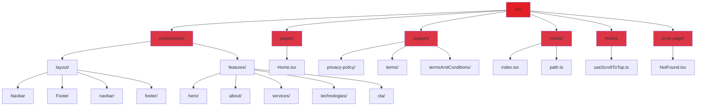

# Eltizam Business Management Platform

> A modern, professional business management and consulting platform built with React, TypeScript, and Bootstrap. Provides comprehensive administrative solutions and financial consulting services.


## Features

- **Fully Responsive Design** - Optimized for all devices and screen sizes
- **Modern UI/UX** - Clean, professional design with smooth animations
- **Type-Safe Development** - Built with TypeScript for robust code
- **SEO Optimized** - Comprehensive meta tags and semantic HTML
- **Fast Performance** - Powered by Vite with instant HMR
- **RTL Support** - Full right-to-left layout for Arabic content
- **Routing System** - Client-side navigation with React Router
- **Policy Pages** - Privacy policy, terms of service, and user terms

## Tech Stack

| Technology | Version | Purpose |
|------------|---------|---------|
| React | 19.0.0 | Modern UI library with latest features |
| TypeScript | 5.6.2 | Type-safe development |
| Bootstrap | 5.3.3 | Responsive CSS framework |
| React Router DOM | 7.11.0 | Client-side routing |
| React Icons | 5.4.0 | Icon library (Font Awesome) |
| Vite | 6.0.11 | Fast build tool and dev server |

## Project Architecture



### Architecture Overview

**Component-Based Structure**
- **Layout Components**: Reusable Navbar and Footer across all pages
- **Feature Components**: Modular sections (Hero, About, Services, etc.)
- **Page Components**: Complete page compositions
- **Support Pages**: Legal and policy documentation

**Routing System**
- Centralized route configuration in `routes/`
- Type-safe path definitions
- Catch-all 404 error handling
- Smooth page transitions with scroll-to-top

**Custom Hooks**
- `useScrollToTop`: Automatic scroll to top on route change
- Reusable across all pages for consistent UX

**Type Safety**
- TypeScript throughout the entire codebase
- Strict type checking for props and state
- Better IDE support and error detection

## Getting Started

### Prerequisites

- Node.js 18+ and npm/yarn
- Modern web browser

### Installation

```bash
# Install dependencies
npm install
```

### Development

```bash
# Start development server (runs on http://localhost:5173)
npm run dev
```

### Production

```bash
# Build for production
npm run build

# Preview production build
npm run preview
```

## Project Structure

```
buma/
├── public/
│   └── image/
│       └── hero/
│           └── hero_img.webp
├── src/
│   ├── components/
│   │   ├── layout/
│   │   │   ├── Navbar.tsx
│   │   │   ├── Navbar.css
│   │   │   ├── Footer.tsx
│   │   │   ├── Footer.css
│   │   │   ├── navbar/
│   │   │   │   ├── NavLinks.tsx
│   │   │   │   ├── MobileMenuButton.tsx
│   │   │   │   └── MobileSidebar.tsx
│   │   │   └── footer/
│   │   │       └── FooterLinks.tsx
│   │   └── features/
│   │       ├── hero/
│   │       ├── about/
│   │       ├── services/
│   │       ├── technologies/
│   │       └── cta/
│   ├── pages/
│   │   └── Home.tsx
│   ├── support/
│   │   ├── privacy-policy/
│   │   │   ├── privacy-policy.tsx
│   │   │   └── privacy-policy.css
│   │   ├── terms/
│   │   │   ├── terms.tsx
│   │   │   └── terms.css
│   │   └── termsAndConditions/
│   │       ├── TermsAndConditions.tsx
│   │       └── TermsAndConditions.css
│   ├── routes/
│   │   ├── index.tsx
│   │   └── path.ts
│   ├── hooks/
│   │   └── useScrollToTop.ts
│   ├── error-page/
│   │   ├── NotFound.tsx
│   │   └── NotFound.css
│   ├── App.tsx
│   ├── App.css
│   └── main.tsx
├── index.html
├── package.json
├── tsconfig.json
└── vite.config.ts
```

## Key Pages

| Page | Route | Description |
|------|-------|-------------|
| **Home** | `/` | Landing page with hero, services, about, and CTA sections |
| **Privacy Policy** | `/privacy-policy` | Data protection and privacy information |
| **Terms of Service** | `/terms-conditions` | Service terms and conditions |
| **User Terms** | `/terms` | User agreement and regulations |
| **404 Error** | `*` | Custom error page for invalid routes |

## Features Breakdown

### Navigation System
- Fixed navbar with scroll effects
- Mobile-responsive sidebar menu
- Smooth scroll to sections
- Brand logo with routing

### Home Page Sections
1. **Hero Section** - Eye-catching introduction with CTA
2. **Technologies** - Showcase of tools and platforms
3. **Services** - Core business offerings
4. **About** - Company mission and values
5. **CTA** - Call-to-action for engagement

### Support Pages
- Comprehensive privacy policy with 7 sections
- Detailed terms and conditions with 6 sections
- User terms with legal definitions
- Professional layout with numbered sections
- Contact information included

### Error Handling
- Custom 404 page with hero background
- Brand consistency maintained
- Clear navigation back to home

## Design System

### Color Palette
- **Primary Red**: #e31e24 (Brand color)
- **Dark Backgrounds**: #0a0a0a, #1a1a1a
- **Text Colors**: White, gray variants
- **Borders**: Subtle gray tones

### Typography
- Modern sans-serif fonts
- Responsive font sizes with clamp()
- Clear hierarchy with headings
- RTL-optimized text alignment

### Layout Principles
- Mobile-first responsive design
- Consistent spacing system
- Grid-based layouts
- Smooth transitions and animations

## SEO Optimization

### Meta Tags
- Comprehensive description and keywords
- Author attribution (Mohamed Fadl)
- Open Graph tags for social sharing
- Twitter Card integration
- Arabic language specification

### Performance
- Image preloading for hero section
- Lazy loading where applicable
- Optimized bundle size
- Fast page transitions

### Accessibility
- Semantic HTML structure
- ARIA labels where needed
- Keyboard navigation support
- RTL language support

## Browser Support

- Chrome (latest)
- Firefox (latest)
- Safari (latest)
- Edge (latest)
- Mobile browsers (iOS Safari, Chrome Mobile)

## Author

**Mohamed Fadl**

## License

All rights reserved - Eltizam Business Management Platform

*Built with React and TypeScript for professional business management solutions*
